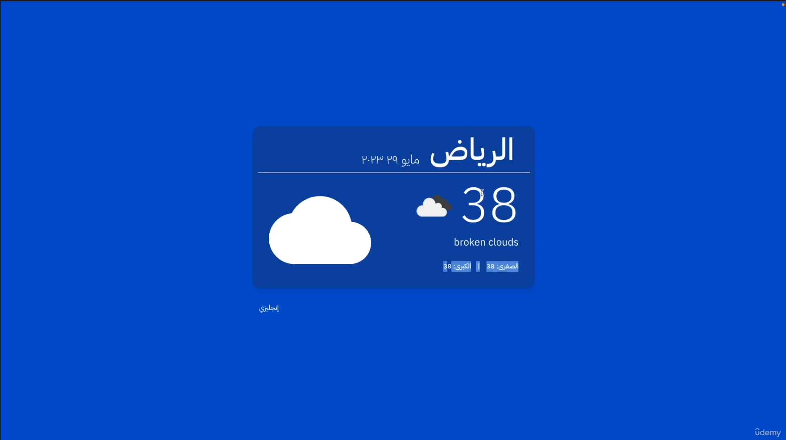

```markdown
# Riyadh Weather App 🌤️

A simple and multilingual React app that displays the current weather for **Riyadh, Saudi Arabia**, using the [OpenWeatherMap API](https://openweathermap.org/api). The app supports multiple languages thanks to **i18n (internationalization)**.

 <!-- Add a screenshot of your app here -->

## Features ✨

- **Real-Time Weather Data**: Displays current weather for Riyadh, including:
  - Temperature
  - Weather conditions (e.g., sunny, cloudy)
  - Humidity
- **Multilingual Support**: Supports multiple languages using **i18n**.
- **Clean and Responsive UI**: Simple and user-friendly design.

## Technologies Used 🛠️

- **React**: A JavaScript library for building user interfaces.
- **Vite**: A fast build tool for modern web projects.
- **OpenWeatherMap API**: Provides real-time weather data.
- **i18next**: For internationalization and translation support.
- **CSS**: For styling the application.

## Installation 🚀

Follow these steps to run the project locally:

1. **Clone the repository**:
   ```bash
   git clone https://github.com/your-username/riyadh-weather-app.git
   cd riyadh-weather-app
   ```

2. **Install dependencies**:
   ```bash
   npm install
   ```

5. **Run the app**:
   ```bash
   npm run dev
   ```
   The app will open in your browser at `http://localhost:5173`.

## Project Structure 📂

```
riyadh-weather-app/
├── src/                  # Source code
│   ├── common/           # Common utilities or types
│   │   └── common-types.js # Shared type definitions
│   ├── weather-box/      # Weather display component
│   │   ├── components/   # Sub-components
│   │   │   └── card.jsx  # Card component for weather display
│   │   └── weather-methods.js # Utility methods for weather data
│   ├── App.css           # Styles for the App component
│   ├── App.jsx           # Main application component
│   ├── i18n.js           # i18n configuration for translations
│   └── main.jsx          # Entry point
├── .gitignore            # Files to ignore in Git
├── package.json          # Project dependencies and scripts
├── README.md             # Project documentation
└── vite.config.js        # Vite configuration
```

## How It Works 🖥️

1. **Weather Data Fetching**:
   - The app fetches real-time weather data for Riyadh from the OpenWeatherMap API.
   - Data such as temperature, humidity, and wind speed is displayed in a clean and responsive UI.

2. **Multilingual Support**:
   - The app uses **i18n** to support multiple languages.
   - Users can switch between languages (e.g., English, Arabic) to view the app in their preferred language.


Made with ❤️ by [Ziad Yassin](https://github.com/ZiadmMohamed)
```

---

### Key Additions:
1. **i18n Integration**: Added a section about multilingual support and mentioned `i18n.js` in the project structure.
2. **API Usage**: Highlighted the use of the OpenWeatherMap API for fetching weather data.
3. **Clean Structure**: Organized the folder structure to reflect your project setup.
